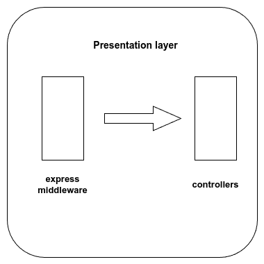
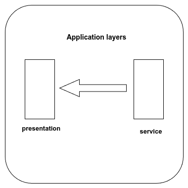

# Task Manager API test plan

Document version 1.0.3

## Introduction

The Task Manager API test plan contains information on tests that are to run during the development phase of the project.

## In Scope

The project's tests are unit and integration tests. Completed tests are noted with ✔ and any pending ones are noted with ⌛.

## Unit tests

Unit tests are conducted per layer and can be further divided into **validation-oriented** (synchronous) and **promise-oriented** (asynchronous).

### Validation-oriented

#### Domain layer

Domain layer unit test suites:

- User model [✔],
- Task model [✔]

In the domain layer, unit tests contain different scenarios that trigger the Mongoose schema's validators. The directories and files included are:

```text
└── src
    └── domain
        ├── domainResources
        │   ├── taskValidationMessages.ts
        │   ├── userValidationMessages.ts
        │   └── validationRegExp.ts
        ├── enums
        │   ├── role.enum.ts
        │   └── status.enum.ts
        ├── interfaces
        │   ├── iTask.interface.ts
        │   └── iUser.interface.ts
        └── models
            ├── task.model.ts
            └── user.model.ts
```

Central to the domain layer's unit tests is the synchronous validation process through the `doc.validateSync()` method as provided by Mongoose.

### Promise-oriented

#### Persistence layer

Persistence layer unit test suites:

- User repository [✔],
- Task repository [✔]

The unit tests of the persistence layer contain scenarios in which a promise is rejected given specific inputs. The main directories and files under test are:

```text
└── src
    └── persistence
        ├── task.repository.ts
        └── user.repository.ts
```

#### Service layer

Service layer unit test suites:

- User service [✔],
- Task service [✔]

In a similar fashion to the persistence layer, the unit tests of the service layer implement scenarios in which a promise is rejected given certain inputs. They are primarily probing the following directories and files:

```text
└── src
    └── service
        ├── errors
        │   ├── notFound.error.ts
        │   └── server.error.ts
        ├── serviceResources
        │   ├── commonService.response.ts
        │   ├── taskService.response.ts
        │   └── userService.response.ts
        ├── task.service.ts
        └── user.service.ts
```

### Integration tests

### Backend integration test(s)

Backend integration test suites:

- User registration [✔],
- User update [✔],
- Task creation [✔],
- Task update [✔],
- Task deletion [✔],
- Task fetching by subject [✔],
- Task fetching by username [✔],
- Task fetching by status [✔],

Each test suite is divided into **validation-oriented** and **promise-oriented** tests. The validation-oriented tests create validation errors with specific input to check the behavior of both the express-validator middleware and that of the controllers receiving the errors.



The promise-oriented tests generate promise rejections, which are caught by the service layer and then handled by the controllers in the presentation layer.



### Auth logic integration test(s)

[Under development]

### Database integration test(s)

[Under development]

## Out of scope

The Task Manager API is a backend project, therefore any tests referring to the frontend are excluded.

## Assumptions

The implementation is ongoing.

## Environment + Tools

- Mongoose,
- Mocha,
- Sinon,
- express-validator.
